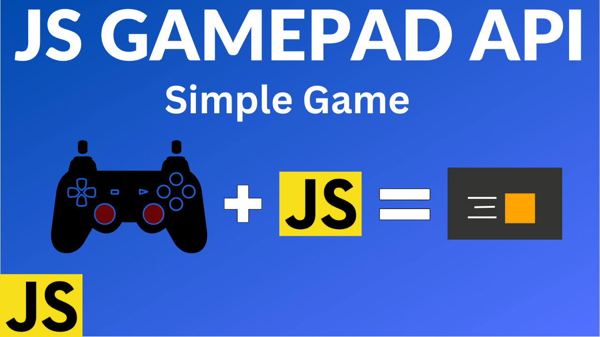

# Learn JavaScript Gamepad API and Build a Simple Game

### Try it here: https://codingwith-adam.github.io/gamepad-api-simple-game/

### YouTube Tutorial: https://youtu.be/GOjMP6WY8CU

## Description

In this exciting tutorial we will use the JavaScript Gamepad API to build a simple game to move a player around on the screen using a controller.

We will be programming the direction pad and left analog stick to move the player on the screen. We will also use the face buttons to change the color of the player depending on the button pressed.

The JS Gamepad API allows developers to use a gamepad as an input device. The most common usage would be for game development. The Gamepad API has 2 events. One event for when a controller is connected and another for when it is disconnected. There is no event for when a button is pressed on the controller. However the developer can ask the Gamepad for the state of the buttons at any time. Included in this state is the list of buttons and a list of axes that represent the analog sticks if there are any. Checking for the controller state can be done in a loop or on a timer. For game development this will happen in the game loop. At the start of each game loop you can retrieve the state of the buttons and then use that information to manipulate your game.

### Gamepad API

https://developer.mozilla.org/en-US/docs/Web/API/Gamepad_API
